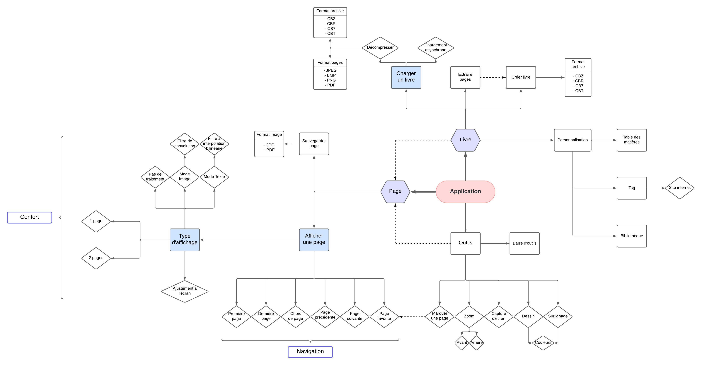

# IN204_Comic_Book_Reader

# Comic Book Reader

This project is a Comic Book Reader coded in C++ with the library. It allows reading and navigating through digital comic books in various file formats (cbz, cbr, cbt, and cb7), it supports the following image formats: PNG, JPG, and BMP. The application offers several features for a comfortable reading experience.

## Aim

## Features

- **Page Display**: Comic book pages are displayed with a layout optimized for the screen, providing a smooth reading experience.

- **Page Navigation**: You can easily move from one page to another using navigation buttons or keyboard shortcuts.

- **Zoom**: The application supports zooming to allow users to view page details accurately with the mouse wheel.

- **Different Reading Modes**: You can choose between different reading modes to adapt the reading experience to your preferences,single-page or double-page reading mode, filter for images, texts or no filter.

## Compiling

- To compile without errors, please update the absolute paths in the Makefile on lines 40 and 371.
- Run 'make' in the main directory
- Execute the comic_book_reader file

## Authors

- Baptiste Montagnes
- Julien Segonne
